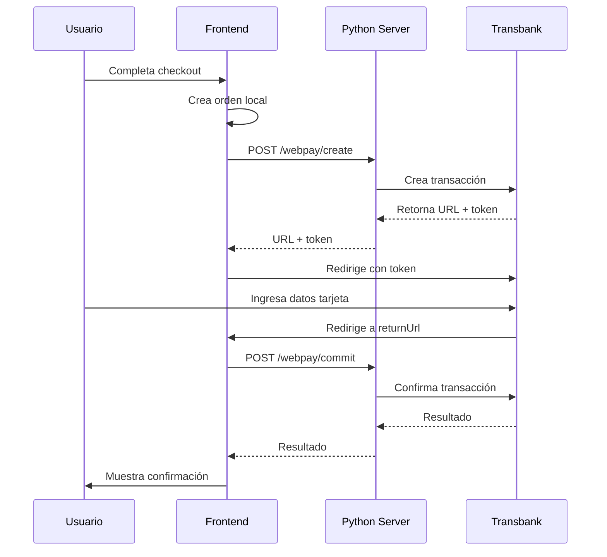

# Integración Webpay Plus con Python SDK

Guía completa para la integración de Webpay Plus en Emara usando el SDK oficial de Transbank para Python.

## 🎯 Información de Tu Comercio

**Código de Comercio de Producción:** `597053036691`

**Email de contacto:** carolinasaezcanales@gmail.com

## 📋 Requisitos

- Python 3.8 o superior
- Node.js 18+ (para el frontend)
- pip (gestor de paquetes de Python)

## 🚀 Inicio Rápido

### Opción 1: Iniciar Todo

```bash
./start-all.sh
```

Esto iniciará:
- Servidor Webpay Plus (Python) en puerto 5001
- Frontend Next.js en puerto 3001

### Opción 2: Solo Webpay Server

```bash
./start-webpay-only.sh
```

### Opción 3: Manual

**Terminal 1 - Servidor Webpay:**
```bash
cd webpay-server
python3 -m venv venv
source venv/bin/activate
pip install -r requirements.txt
python app.py
```

**Terminal 2 - Frontend:**
```bash
cd frontend
PORT=3001 npm run dev
```

## ⚙️ Configuración

### 1. Configurar Servidor Python

Editar `webpay-server/.env`:

```env
# Tu código de comercio de producción
TRANSBANK_COMMERCE_CODE=597053036691

# API Key (solicitar a Transbank para producción)
TRANSBANK_API_KEY=

# Ambiente: INTEGRACION para pruebas, PRODUCCION para producción
TRANSBANK_ENVIRONMENT=INTEGRACION

# URL de tu aplicación
BASE_URL=http://localhost:3001

PORT=5001
DEBUG=True
```

### 2. Variables de Entorno Frontend

El frontend está configurado para conectarse a `http://localhost:5001` por defecto.

Para cambiar esto en producción, actualizar las URLs en:
- `frontend/app/checkout/page.tsx`
- `frontend/app/checkout/webpay/return/page.tsx`

## 🔄 Flujo de Pago



## 📡 API Endpoints

### Health Check
```http
GET http://localhost:5001/health
```

**Respuesta:**
```json
{
  "status": "ok",
  "service": "Webpay Plus Python Server",
  "environment": "INTEGRACION",
  "commerce_code": "597053036691"
}
```

### Crear Transacción
```http
POST http://localhost:5001/webpay/create
Content-Type: application/json

{
  "orderId": "order_123",
  "amount": 15000,
  "buyOrder": "ORDER-001",
  "returnUrl": "http://localhost:3001/checkout/webpay/return"
}
```

**Respuesta Exitosa:**
```json
{
  "success": true,
  "url": "https://webpay3gint.transbank.cl/webpayserver/initTransaction",
  "token": "01ab89c...",
  "buyOrder": "ORDER-001",
  "amount": 15000
}
```

### Confirmar Transacción
```http
POST http://localhost:5001/webpay/commit
Content-Type: application/json

{
  "token": "01ab89c..."
}
```

**Respuesta Exitosa:**
```json
{
  "success": true,
  "vci": "TSY",
  "amount": 15000,
  "status": "AUTHORIZED",
  "buyOrder": "ORDER-001",
  "authorizationCode": "1213",
  "responseCode": 0,
  "message": "Pago aprobado exitosamente"
}
```

## 🧪 Pruebas

### Ambiente de Integración

El servidor viene configurado con el ambiente de integración por defecto.

**Tarjetas de Prueba:**

| Tarjeta | Número | CVV | Fecha | Password |
|---------|--------|-----|-------|----------|
| Visa | 4051 8856 0000 0002 | 123 | Cualquier futura | 123 |
| Mastercard | 5186 0595 0000 0002 | 123 | Cualquier futura | 123 |
| Redcompra | 4051 8860 0000 0001 | - | Cualquier futura | 123 |

### Códigos de Respuesta

| Código | Significado |
|--------|-------------|
| 0 | ✅ Transacción aprobada |
| -1 | ❌ Rechazo de transacción |
| -2 | ⚠️ Transacción debe reintentarse |
| -3 | ❌ Error en transacción |
| -4 | ❌ Rechazo de transacción |
| -5 | ❌ Rechazo por error de tasa |
| -6 | ❌ Excede cupo máximo mensual |
| -7 | ❌ Excede límite diario |
| -8 | ❌ Rubro no autorizado |

## 🔒 Pasar a Producción

### 1. Solicitar Credenciales de Producción

Contactar a Transbank:
- **Email:** soporte@transbank.cl
- **Teléfono:** 600 638 6380 (fijo) / 562 2661 2700 (móvil)
- **Slack:** [Transbank Developers](https://transbank-developers.slack.com)

Proporcionar:
- Código de comercio: **597053036691**
- Documento de validación de integración

### 2. Actualizar Configuración

En `webpay-server/.env`:
```env
TRANSBANK_COMMERCE_CODE=597053036691
TRANSBANK_API_KEY=tu_api_key_de_produccion_aqui
TRANSBANK_ENVIRONMENT=PRODUCCION
BASE_URL=https://tu-dominio.cl
```

### 3. Actualizar Código

En `webpay-server/app.py`, reemplazar:
```python
if ENVIRONMENT == 'PRODUCCION':
    from transbank.common.options import Options
    options = Options(
        commerce_code=COMMERCE_CODE,
        api_key=API_KEY,
        integration_type=IntegrationType.LIVE
    )
    Transaction.configure(options)
else:
    Transaction.configure_for_testing()
```

### 4. Validación con Transbank

1. Completar formulario en [Transbank Developers](https://www.transbankdevelopers.cl)
2. Realizar transacciones de prueba
3. Enviar evidencias a soporte@transbank.cl
4. Esperar aprobación

### 5. Desplegar

- Servidor debe tener HTTPS
- Configurar dominio real
- Actualizar URLs en frontend
- Configurar firewall para puerto 5001 (o usar proxy reverso)

## 📊 Logs y Monitoreo

### Ver Logs en Tiempo Real

**Webpay Server:**
```bash
tail -f logs/webpay.log
```

**Frontend:**
```bash
tail -f logs/frontend.log
```

### Logs del Servidor Python

El servidor imprime información detallada:

```
Creating Webpay transaction:
  Buy Order: ORDER-12345
  Session ID: session_order_123_1735586400.123
  Amount: $15000 CLP
  Return URL: http://localhost:3001/checkout/webpay/return

Transaction created successfully:
  Token: 01ab89c...
  URL: https://webpay3gint.transbank.cl/...

✓ Payment approved successfully
```

## 🐛 Troubleshooting

### Error: Port 5001 already in use

```bash
# Encontrar el proceso
lsof -i :5001

# Matar el proceso
kill -9 [PID]

# O cambiar el puerto en .env
PORT=5002
```

### Error: Module 'transbank' not found

```bash
cd webpay-server
source venv/bin/activate
pip install transbank-sdk
```

### Error: CORS

Verificar que `CORS(app)` esté habilitado en `app.py`

### Transacción no se confirma

1. Verificar logs del servidor Python
2. Verificar que el token sea correcto
3. Verificar conectividad con Transbank
4. Revisar que las credenciales sean correctas

### Timeout en producción

- Aumentar timeout en configuración del servidor
- Verificar conectividad HTTPS
- Revisar firewall

## 📚 Documentación Adicional

- [Transbank Developers](https://www.transbankdevelopers.cl)
- [SDK Python](https://github.com/TransbankDevelopers/transbank-sdk-python)
- [API Reference](https://www.transbankdevelopers.cl/referencia/webpay)
- [Guía de Integración](https://www.transbankdevelopers.cl/documentacion/como_empezar)

## 🆘 Soporte

### Transbank
- **Email:** soporte@transbank.cl
- **Teléfono:** 600 638 6380 (fijo) / 562 2661 2700 (móvil)
- **Slack:** [Transbank Developers](https://transbank-developers.slack.com)
- **Horario:** Lunes a Viernes, 9:00 - 18:00

### Documentación del Proyecto
- Ver `webpay-server/README.md` para detalles del servidor Python
- Ver `WEBPAY-SETUP.md` para configuración completa
- Ver `frontend/README.md` para frontend

## 📝 Checklist de Producción

- [ ] Solicitar API Key de producción a Transbank
- [ ] Actualizar `.env` con credenciales de producción
- [ ] Cambiar `TRANSBANK_ENVIRONMENT` a `PRODUCCION`
- [ ] Configurar HTTPS en servidor
- [ ] Actualizar URLs en frontend (quitar localhost)
- [ ] Probar transacciones en producción
- [ ] Completar formulario de validación de Transbank
- [ ] Recibir aprobación de Transbank
- [ ] Configurar monitoreo y alertas
- [ ] Documentar proceso para equipo

## 🔐 Seguridad

- ✅ SDK oficial de Transbank
- ✅ Comunicación HTTPS con Transbank
- ✅ Variables de entorno para credenciales
- ✅ Validación de tokens
- ✅ Logs sin información sensible
- ⚠️ En producción, agregar rate limiting
- ⚠️ En producción, agregar autenticación adicional

## 📄 Licencia

MIT
